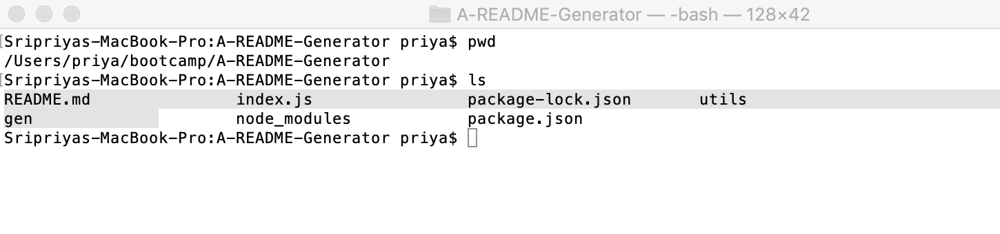

# A README Generator


## Table Of Contents
* [Description](#description)
* [Video of the README.md file generation](#video-of-the-readmemd-file-generation)
* [Installation](#installation)
* [Usage](#usage)
* [Code Snippets](#code-snippets)
* [Tests](#tests)
* [License](#license)
* [Author Links](#author-links)
## Description
This program generates a README.md markdown file, a source of information about the project. This program uses the inquirer.js module to prompt the user for the information they want to include in the file. This information is then used to generate the markdown (in the generateMarkdown.js module). The README.md file is then created with the markdown under the *gen* folder. 

A simple version of this README was created using the generator (as seen in the video below). I included further information after generating the file - adding these notes, the video below etc.

## Video of the README.md file generation
The README generator receives user input and generates the README.md in the *gen* folder. 
<https://watch.screencastify.com/v/EkRye2uhgsYXVeiuBunT>

## Installation
This requires the installation of inquirer.js and the fs (native) module. Please do the following in your bash:

```bash 
$ npm init -y
$ npm install inquirer@6.3.1
```

## Usage
To use this generator, please do the following:

```bash
$ mkdir gen
$ node index.js
```
Please create the *gen* folder within the folder in which you have the index.js. index.js and gen should be in the same folder. Answer the prompt questions and proceed to generate the file README.md. The file is generated in the *gen* folder.



## Code Snippets
### 1. Prompt the user for the sections and information they want to include in the README file

#### An array of questions, and prompt types. Where the type is "editor", the editor opens up for the user to enter the text.
```
const questions = [
    {
      type: 'input',
      message: "Please enter a title for your project:",
      name: 'title'
    },
     
```
#### inquirer to prompt the user for answers. Call generateMarkdown to get the markdown based on the response. Write to the README.md file.
```
function getUserInputs() {
  inquirer.prompt(questions).then((response) => { 
              console.log(response);
              let markdown = generateMarkdown.generateMarkdown(response);
              writeToFile("./gen/README.md", markdown);
            });
}
```
### 2. Generate the markdown using the responses (showing only part of the function).
```
function generateMarkdown(data) {
  console.log("generating markdown ...");
    let markdown = "";
    // title
    markdown += `# ${data.title}\n`;

    // Badge here
    markdown += renderLicenseBadge(`${data.license}`);
    markdown += `\n`;
    
    ...

```
### 3. Write the markdown to the README.md file
```
function writeToFile(fileName, data) {
  fs.writeFile(fileName, data, function(err) {
    if(err) {
      console.log("Error in writing to file: " + err);
    } else {
      console.log("wrote to README.md successfully");
    }
  });
}
```
### 4. Generate the license badge (showing only part of the function *renderLicenseBadge()*)
```
 switch(licenseType) {
      case 'MIT': badge = "";
                    break;
      case 'BSD':
      case 'Apache': badge = "";
                    break;
      case 'GNU': badge = "";
                    break;
      default: badge = "";
    }
```
## Tests
- Check if a README.md file exists under the *gen* directory in your source code folder
- Open the README.md and check if all the sections have been created.
- The License badge should appear under the title at the top.
- The Table of Contents should have links that can be clicked to navigate to the different sections.
- All input from the user should be listed under the appropriate sections.
- The license chosen by the user should be listed in the License section.

## License
This application is covered under the [MIT License](https://opensource.org/licenses/MIT).

## Author Links
[GitHub](https://github.com/sbhikshe)\
[LinkedIn](https://www.linkedin.com/in/sripriya-bhikshesvaran-8520992/)
